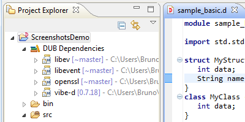

## DDT features

 * Project viewer (with flat or hierarchical packages view). New D project wizard.
 
||
|----|
   * (Yes, the project view has the name "Script" Explorer due to an internal limitation related to the use of DLTK).
 * D Editor:
   * Syntax Highlighting (configurable styling) and syntax error reporting.
   * Folding of source blocks, bracket matching.
   * Outline view of source file elements and Quick-Outline. (`Ctrl+O`)
   
| `Quick outline popup, with name filter "*Aut"`|
|----|
   * DDoc viewer hovers. (renders DDoc into corresponding HTML)
   
||
|----|
   * Find Definition (aka Open Definition, Reference Resolving). (`F3` or `Ctrl+mouse-click`)
   * Content Assist (aka Code Completion, Intellisense). (`Ctrl+Space`) Resolves references to symbols/definitions, has the exact same semantic capabilities as Reference Resolving.
     * Can only resolve non-qualified named references, or qualified named references whose segments are all names (ie: `std.stdio.writeln`).
     * Some qualified references with expression segments, like `member` in `(new Foo()).member` work as well, the rest don't.
     * Can not distinguish between function or template overloads.
     * There are several other semantic limitations. TODO: describe more precisely which semantic constructs are supported and which are not.

|  |  |
|----|----|
 * Semantic Search - searches for elements (variables, functions, types, references, etc.)
   * Open-Type dialog. Search and open a type (or type-like definition such as templates or aliases) using text pattern. (`Ctrl+Shift+T`)

||
|----|
   * Search Dialog. Search for definitions based on a text pattern. (`Ctrl+H`)
   * Search Dialog. Search for all references to a given definition. (`Ctrl+Shift+G`)
     * *Experimental*: Search Dialog feature is experimental and can have several bugs and limitations.

| `Search results after searching for "writeln" references`|
|----|
 * Simple built-in builder support (automatically generates a response file for the D compiler to build the whole project). Can automatically launch created executable.
   * This is good enough for toy projects only. For more serious projects an external builder should be used. D projects in DDT can be configured to use an external builder instead of the default one.

 * Debugging functionality. Fully featured GDB debugger support (reusing Eclipse CDT's GDB integration)
  * Stop/resume program execution. Listing program threads and stack frame contents.
  * Setting breakpoints, watchpoints (breakpoint on data/variables), tracepoints. Breakpoint conditions.
  * Stack variables inspection view. Expression watch and view. Disassembly view.
  * Non-stop mode (for supported GBDs). Reverse debugging (for supported GDB targets).
  * Most of Eclipse CDT is now a requirement for DDT (for the debugging feature). 

|  `Execution stopped on a conditional breakpoint` |  `Variables for current stack frame` |
|----|----|

