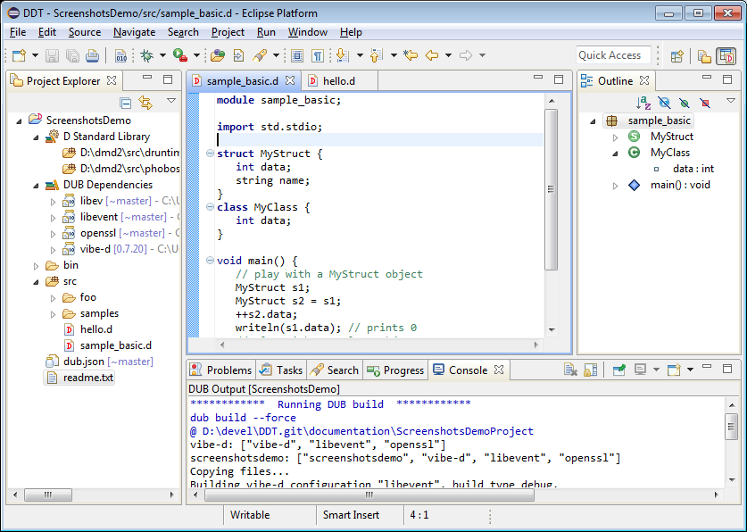
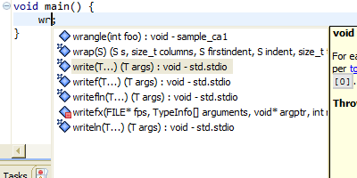

## DDT - D Development Tools:

## DDT features:
 * Build and project configuration/dependencies support using [DUB](http://code.dlang.org/about).
 * Project viewer annotated with DUB elements (under the Project Explorer view).
 
||
|----|

 * D source editor:
   * Syntax Highlighting (configurable styling) and syntax error reporting.
   * Folding of source blocks, bracket matching.
   * Outline view of source file elements and Quick-Outline. (`Ctrl+O`)
   
| `Quick outline popup, with name filter "*Aut"`|
|----|

   * DDoc editor hover. (renders DDoc into an annotated visual representation)
   
||
|----|
   * Find Definition (aka Open Definition, Reference Resolving). (`F3` or `Ctrl+mouse-click`)
   * Content Assist (aka Code Completion, Intellisense). (`Ctrl+Space`) Resolves references to symbols/definitions, has the exact same capabilities as Reference Resolving.
   * Content Assist code snippets (configurable). 

|  |  |
|----|----|

#### Debugging functionality. 
Fully featured GDB debugger support (uses Eclipse CDT's GDB integration)
  * Stop/resume program execution. Listing program threads and stack frame contents.
  * Setting breakpoints, watchpoints (breakpoint on data/variables), tracepoints. Breakpoint conditions.
  * Stack variables inspection view. Expression watch and view. Disassembly view.
  * Non-stop mode (for supported GBDs). Reverse debugging (for supported GDB targets).

|  `Execution stopped on a conditional breakpoint` |  `Variables for current stack frame` |
|----|----|
