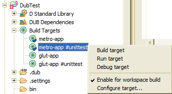
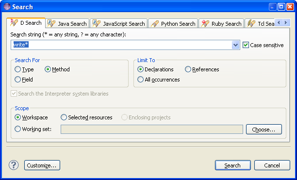

## User Guide

*Note:* For an overview of DDT features, see [Features](Features.md#ddt-features). This also serves to document 
what overall functionalities are available.

### Configuration

A [D installation](http://dlang.org/download.html) is required for most IDE functionality, as well as the [DUB tool](http://code.dlang.org/about).

* The D compiler from the D installation should be found in the `PATH` environment variable. This is so the standard library source modules can be found and used (for code completion, etc.).

 * The path to the `dub` executable should be configured in the `DDT` preference page, which can be accessed from the menu `Window / Preferences`. The path can be an absolute path, or just the executable name, in which case the executable will be searched in the PATH environment variable.

### Eclipse basics

If you are new to Eclipse, you can learn some of the basics of the Eclipse IDE with this short intro article: 
[An introduction to Eclipse for Visual Studio users
](http://www.ibm.com/developerworks/opensource/library/os-eclipse-visualstudio/)

Also, to improve Eclipse performance and startup time, it is recommended you tweak the JVM parameters. There is a tool called Eclipse Optimizer that can do that automatically, it is recommended you use it. Read more about it [here](http://www.infoq.com/news/2015/03/eclipse-optimizer). (Installing/enabling the JRebel optimization is not necessary as that only applies to Java developers)

### Project setup

##### Project creation
A new D project can be created in the Project Explorer view. Open `New / Project...` and then `D / DUB Project`. The D perspective should open after creation, if it's not open already.

##### Project configuration
Most project settings (such as source folders, or build configurations) are specified in the DUB package manifest file (typically `dub.json`). You will need to be familiar with the format of this file, see [here](http://code.dlang.org/package-format).
DDT will detect any changes to the file automatically, and subsequently run `dub describe` to resolve DUB dependencies, and obtain other DUB package information. If an error occurs during this operation, you can view the output of the command in the `D Build` console page in the Console view.   

##### D Standard Library setup
Every time `dub describe` is invoked, DDT will also search for a compiler in the `DUB_COMPILERS_PATH` and `PATH` environment variables. (`DUB_COMPILERS_PATH` is examined in the same way as the `PATH` variable). Most compiler standard-library directory layouts, relative to the compiler executable, should be recognized (be it DMD, GDC, or LDC). 

> If DDT does not find the standard library locations, it is not possible to manually configure them at the moment. As a workaround, download and unpack the official DMD release archive (to use as a mock compiler installation), and put the *binaries directory* in the `DUB_COMPILERS_PATH` environment variable. This way DDT will find the standard library locations, although the compiler used for actual compilation may be a differnt one. (You can also replace the standard library source folders of this compiler installation with symbolic links to you actual, up-to-date compiler installation)

##### DUB Package Search Paths

In a project's context menu, there is DUB submenu with a few DUB commands, in particular some to add or remove a project's location to the list of DUB package paths:

<a href="screenshots/UserGuide_DubCtxMenu.png?raw=true"><a/> 

 

This may be necessary since D projects will not be visible as dependencies to other DUB packages unless they have been placed on the local packages path list.

##### Project Building

D projects are built using DUB. The output of this tool will be displayed in a console. Additionally, error markers resulting from the build will be collected and displayed in the the D editor and the Problems view.

Note that if the `Project / Build Automatically` option in the main menu is enabled (the default), a workspace build will be requested whenever any file is saved. Turn this on or off as desired.

D projects have Build Targets derived from DUB configurations. These can be viewed and configured in the Project Explorer:

<a href="screenshots/UserGuide_BuildTargets.png?raw=true"><a/> 

Each target can be enabled or disabled individually when performing Eclipse project builds. 

### Editor and Navigation

##### Editor newline auto-indentation:
The editor will auto-indent new lines after an Enter is pressed. Pressing Backspace with the cursor after the indent characters in the start of the line will delete the indent and preceding newline, thus joining the rest of the line with the previous line. Pressing Delete before a newline will have an identical effect.
This is unlike most source editors - if instead you want to just remove one level of indent (or delete the preceding Tab), press Shift-Tab. 

##### Open Definition:
The Open Definition functionality is invoked by pressing F3 in the DDT source editor, or by clicking the Open Definition button placed in the toolbar. When using the toolbar button, Open Definition will work in any text editor, however it won't be able to follow imports across modules if the file is not on the build path of a DDT project. Open Definition is also available in the editor context menu and by means of editor *hyper-linking* (hold Ctrl and select a reference with the mouse).

Open Definition functionality should find any definition under basic reference contexts, but references under complex expressions might resolve inaccurately, or not at all.
Particularly: function call overloading, template overloads, template instantiation, IFTI, operator overloading are not currently understood by the semantic engine.

##### Code-Completion/Auto-Complete:
Invoked with Ctrl-Space. This functionality is generally called Content Assist in Eclipse. For DDT, it has the same semantic power as Open Definition to determine completions. Can be used in import statements to list available modules to import.

Content Assist can also present Code Templates. These are predefined parameterized blocks of code that can be automatically inserted in the current source. These can be configured in the preferences, under 'DDT/Editor/Code Templates'.

##### Text Hover:
Text hover shows a text popup over the reference or definition under the mouse cursor. The hover will display the signature of the definition, as well as DDoc, if available. DDoc will be rendered in a graphical way, similar to a standard HTML presentation.

##### Open-Type dialog:
Invoked with Ctrl-Shift-T. This is a dialog that allows one to search for any definitions (types or meta-types) and open an editor on the source of the selected definition. Search works the same as JDT, a simple text filter can be used, or camel-case matching can be used to match the desired element (for example: the `FEx` text will match `FiberException`, `FileException`, `FormatException`, etc.). Wildcards can also be used in the filter text.
 
##### Hierarchy View:
These are not currently supported/implemented, even though they are present in the UI.

##### Semantic Search:
The search dialog allows searching for definitions based on a text pattern. Available in the main menu, under 'Search' / 'D...':

<a href="screenshots/UserGuide_SearchDialog.png?raw=true"><a/> 

It is also possible to search for all references to a given definition. In the editor, select the name of a definition, and use the editor context menu to search for references (shortcut: Ctrl-Shift-G). This can also be invoked on references, invoking a search for all references to the same definition the selected reference resolves to.

### Launch and Debug:
To run a D project that builds to an executable, you will need to create a launch configuration. Locate the main menu, open 'Run' / 'Run Configurations...'. Then double click 'D Application" to create a new D launch, and configure it accordingly. You can run these launches from the 'Run Configurations...', or for quicker access, from the Launch button in the Eclipse toolbar.

Alternatively, to automatically create and run a launch configuration (if a matching one doesn't exist already), you can select a D project in the workspace explorer, open the context menu, and do 'Run As...' / 'D Application'. (or 'Debug As...' for debugging instead). If a matching configuration exists already, that one will be run.

Whenever a launch is requested, a build will be performed beforehand. This behavior can be configured under general Eclipse settings, or in the launch configuration.

##### Debugging

| **Windows note:** _Using Cygwin GDB doesn't work very well, if at all. The recommended way to debug in Windows is to use the GDB of [mingw-w64](http://mingw-w64.org/), or the one of [TDM-GCC](http://tdm-gcc.tdragon.net/)._ |
|----|

You can debug a D program by running a launch in debug mode. You will need a GDB debugger. To configure debug options (in particular, the path to the debugger to use), open the launch under 'Run' / 'Debug Configurations...', and then navigate to the 'Debugger' tab in the desired launch configuration:

<a href="screenshots/UserGuide_DebuggerLaunchConfiguration.png?raw=true"><a/> 

GDB debugger integration is achieved by using the CDT plugins. To configure global debugger options, go the 'C/C++'/'Debug'/'GDB' preference page.

**Note that for debugging to work**, the program must be compiled with debug symbols information, and those debug symbols must be on a format that GDB understands. Otherwise you will get GDB error messages such "(no debugging symbols found)" or "file format not recognized". See http://wiki.dlang.org/Debugging for more information on what debug symbols format each compiler produces.
